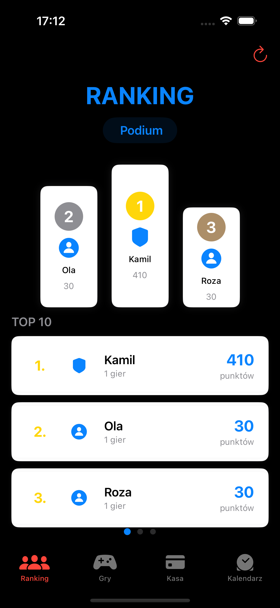
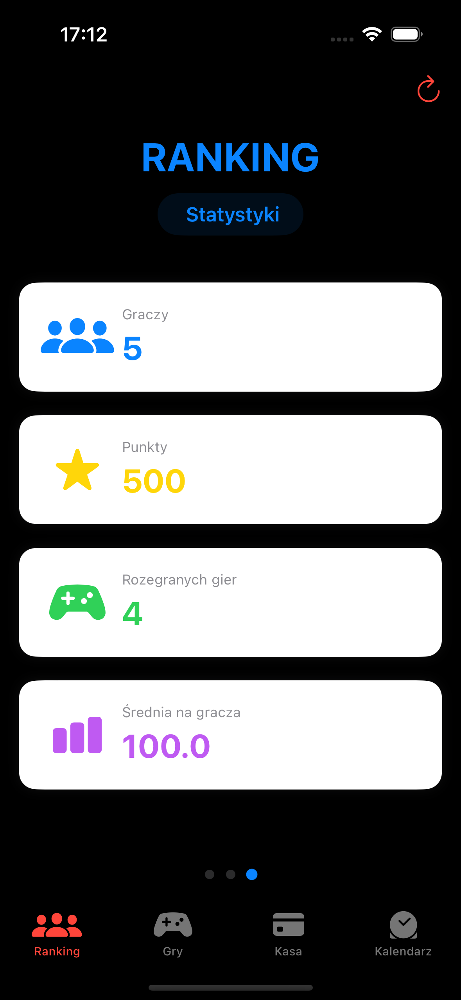
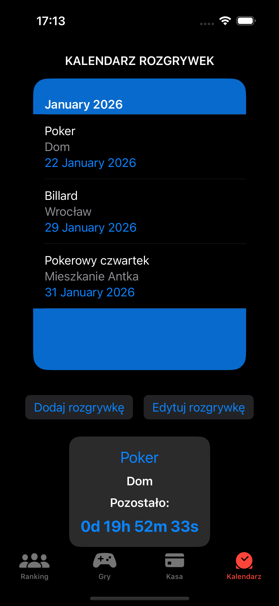
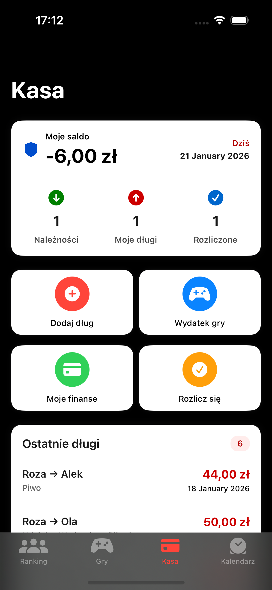
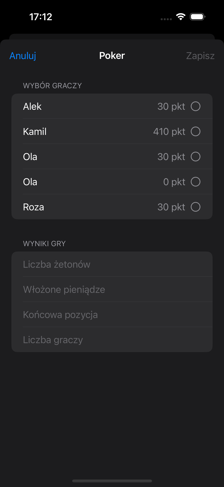

# Game Manager App

This is an iOS application built with SwiftUI that helps a group of friends manage games, rankings, shared expenses, and debts.

The app allows users to:
- manage players and rankings across different games,
- track upcoming games in a shared calendar,
- split game-related expenses,
- manage debts between players,
- settle balances transparently,
- and notify players about their debts using iMessage.

The project is designed as a personal learning project focused on modern iOS technologies, clean architecture, and real-life use cases.

## Features

- 🎮 Player management with avatars and ranking system
- 🏆 Ranking views with podium, list, and statistics
- 📅 Game calendar with upcoming events and countdown
- 💸 Expense tracking and automatic debt calculation
- 🤝 Debt settlement system with balance calculation
- ♿ Accessibility-friendly UI 
- 🧩 Modular architecture with ViewModels

## Technologies used

- Swift
- SwiftUI
- SwiftData
- MVVM architecture
- Xcode

## Notes

This project is under active development and may evolve over time.
It is primarily intended for educational purposes and portfolio presentation.

## 📸 Screenshots

### Ranking & Players
| Podium | List |
|------------------|-----------------|
|  |  |

### Calendar & Events

  

### Money, Debts & Settlements

| Money | Settlements |
|-------|-------------|
|  |  |

### Game Scoring

  

